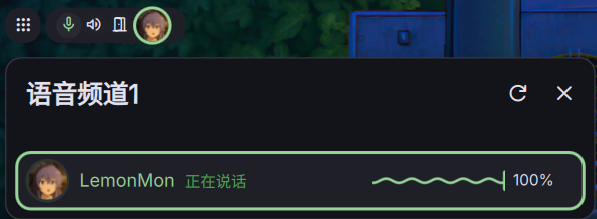

# TS6 Monitor

> English | [简体中文](./README.md)



A **TeamSpeak 6** status monitor widget for [DankMaterialShell](https://danklinux.com) (DMS), the material-design shell for [niri](https://github.com/YaLTeR/niri) (Wayland). It reads your TS6 client state through TS6's official **Remote Apps API** (WebSocket) and shows it right in the bar — plus real interactive controls on the pill.

## Features

- **Live status on the pill**
  - Current channel members as avatar stack (with speaking ring)
  - Microphone / speaker / away state
  - Away message shown as text on the pill while away
  - Per-member mic-mute / output-mute corner badge and away graying
- **One-click controls** (virtual key presses, work without focus)
  - Toggle microphone
  - Toggle speaker / mute
  - Toggle away (also mutes the mic)
- **Volume control** — drag or scroll on the pill / popout to adjust the overall TeamSpeak volume (PipeWire), with an on-screen OSD
- **Popout panel**
  - Server / channel / member count rows (optional)
  - Member list with avatars, nicknames, talking / muted / away states
  - Per-member read-only volume bar; adjustable overall volume for yourself
- **Bilingual UI** — 中文 / English, switch instantly in the settings (applies to the pill, popout and settings page)
- Pill hides automatically when you are not connected to / inside a channel

## Requirements

- DankMaterialShell (DMS) >= 1.4.0
- TeamSpeak 6 client with **Remote Apps** enabled
- Linux (developed on CachyOS / niri / Wayland)

## Installation

1. Clone or download this repo into your per-user DMS plugin directory:
   ```bash
   mkdir -p ~/.config/DankMaterialShell/plugins
   git clone https://github.com/lemonmon/dms-plugin-TS6Monitor ~/.config/DankMaterialShell/plugins/TS6Status
   ```
2. Restart DMS (or reload plugins).
3. Enable the plugin in DMS **Settings → Plugins**; choose a horizontal/vertical pill variant.

## First-time authorization

1. Make sure TeamSpeak 6 is running with **Remote Apps** enabled (Settings → Remote Apps).
2. The plugin connects to the Remote Apps WebSocket (`ws://127.0.0.1:5899` by default).
3. Approve the app in **TeamSpeak → Settings → Remote Apps → Permission Requests**. The API key is stored automatically.
4. The pill appears once you join a channel.

## Setting up the buttons

The three pill buttons send **virtual key presses** to TS6, so they work even when the TeamSpeak window is not focused. TeamSpeak currently cannot record shortcuts natively under Wayland, so launch it in X11 mode:

```
your-ts6-launcher --ozone-platform=x11
```

Then in **TeamSpeak → Settings → Key Bindings**, add bindings:

| Action                    | While recording, click |
|---------------------------|------------------------|
| Toggle Microphone         | the mic button on the pill |
| Toggle Speaker / Mute     | the speaker button |
| Toggle Away               | the away button |

The virtual key identifiers default to `dms.ts6.mic`, `dms.ts6.mute`, `dms.ts6.leave` and can be changed in the plugin settings.

## Settings

| Option | Description |
|--------|-------------|
| 语言 / Language | Switch the UI between Chinese and English instantly |
| Host / Port | Remote Apps WebSocket endpoint (default `127.0.0.1:5899`) |
| Mic / Speaker / Away key ID | Virtual key identifiers for the pill buttons |
| Show avatars / volume / server / channel / member count | Toggle the corresponding UI elements |

## Usage tips

- Scroll on the pill, or drag the volume bar in the popout, to change the overall TeamSpeak volume. An OSD shows the new level.
- The away button shows your away message on the pill while you are away.
- Refresh avatars / nicknames via the refresh icon in the popout header.

## Compatibility

- Built and tested on DMS 1.x with niri (Wayland), PulseAudio/PipeWire.
- If your bar is vertical, use the vertical pill variant.

## Security notes

- The plugin talks to the TeamSpeak Remote Apps API over a WebSocket bound to the loopback address `ws://127.0.0.1:5899` by default (plaintext, local machine only).
- Do not change the host to a remote address or expose the Remote Apps port through your firewall to untrusted networks.
- The authorized key stored in `apiKey.txt` lives only in your plugin directory (excluded via `.gitignore`); never commit or share it.

## License

MIT — see [LICENSE](./LICENSE).